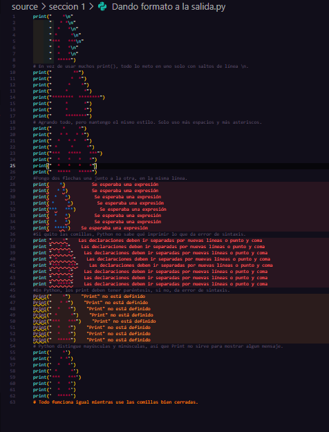
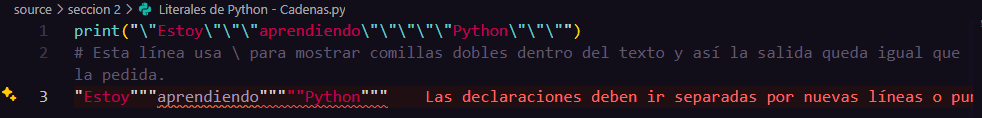
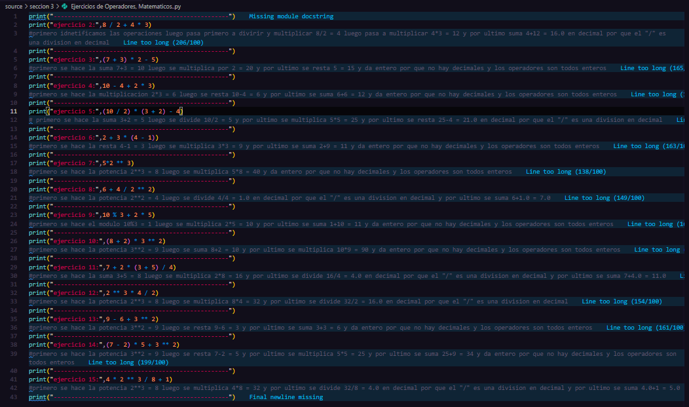
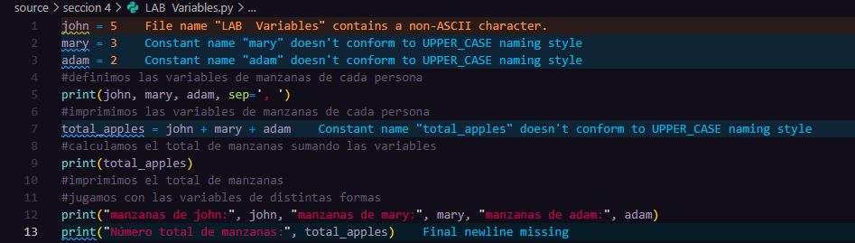

##SECCIÓN 1

## Laboratorio 1 - Uso de print()

- Usé `print("Hola mundo")` y funcionó bien.
- Probé `print('Ricardo')` y también funcionó.
- Intenté `print(Ricardo)` sin comillas y dio error porque no existe la variable.
- Escribí `print"Ricardo"` y `print'Ricardo'` sin paréntesis y ambos
  

## Laboratorio 2 - La función print() y sus argumentos

- El primer print pone "Programming" y no da salto de línea, por eso el siguiente sale pegado.
- El segundo print pone "Essentials" y le suma "\*\*\*in..." al final, todo en la misma línea.
- El último print pone "Python" y ahora sí hace salto de línea porque es el valor por defecto.
- Así
  

## Laboratorio 3 - Dando formato a la salida

- Usé solo un print con varios saltos de línea `\n` para dibujar la flecha, así el código es más corto.
- Probé agrandar la flecha usando más espacios y asteriscos, manteniendo el mismo estilo.
- Puse dos flechas una junto a la otra, solo duplicando el patrón.
- Si quito las comillas, Python marca error porque no sabe qué imprimir.
- Si quito los paréntesis, también da error porque en Python los print necesitan paréntesis.
- Si escribo `Print` con mayúscula, Python no lo reconoce porque distingue entre mayúsculas y minúsculas.
- Usar comillas simples o dobles funciona igual, mientras estén
  

#SECCIÓN 2

## Laboratorio 1 - Literales de Python - Cadenas

- Usé `\` para que Python muestre las comillas dobles dentro del texto y así la salida queda igual que la pedida.
  

#SECCIÓN 3

## Laborario 1 - Ejercicios de Operadores, Matemáticos

- Resuelvo cada ejercicio siguiendo el orden de operaciones: primero paréntesis, luego potencias, multiplicaciones/divisiones y al final sumas/restas.
- Si uso `/`, el resultado es decimal; si solo uso `+`, `-`, `*`, `**` o `%`, el resultado es entero.
- Es importante poner todo el cálculo dentro de `print()` para que Python lo muestre correctamente.
- Los comentarios me ayudan a entender paso a paso cómo se resuelve cada operación.

#SECCIÓN 4  

## Laboratorio 1 - Variables

- Definí variables para guardar las manzanas de cada persona.
- Imprimí los valores usando print y separando por comas.
- Sumé las variables para calcular el total de manzanas.
- Mostré el total y también probé imprimir los nombres junto con sus cantidades
